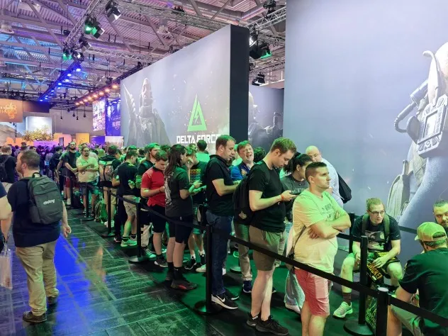
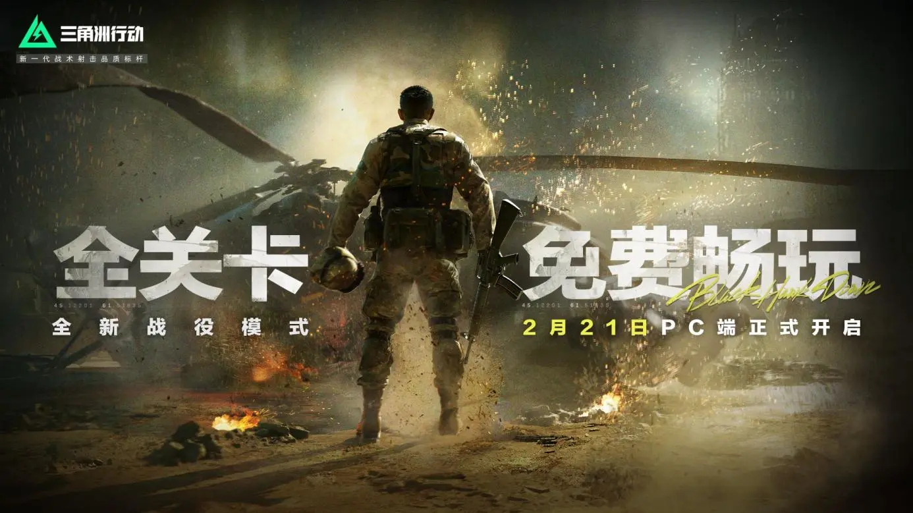
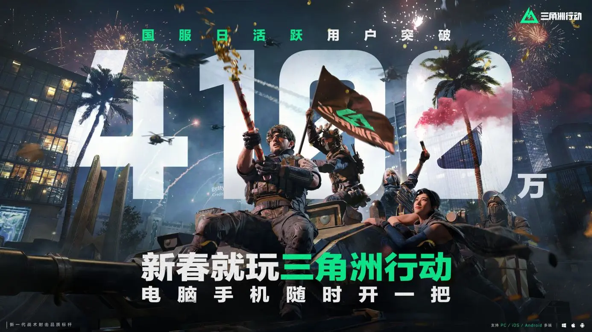
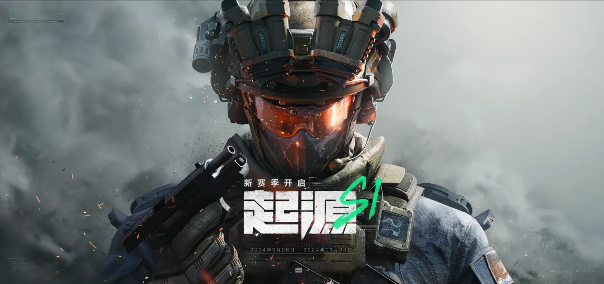
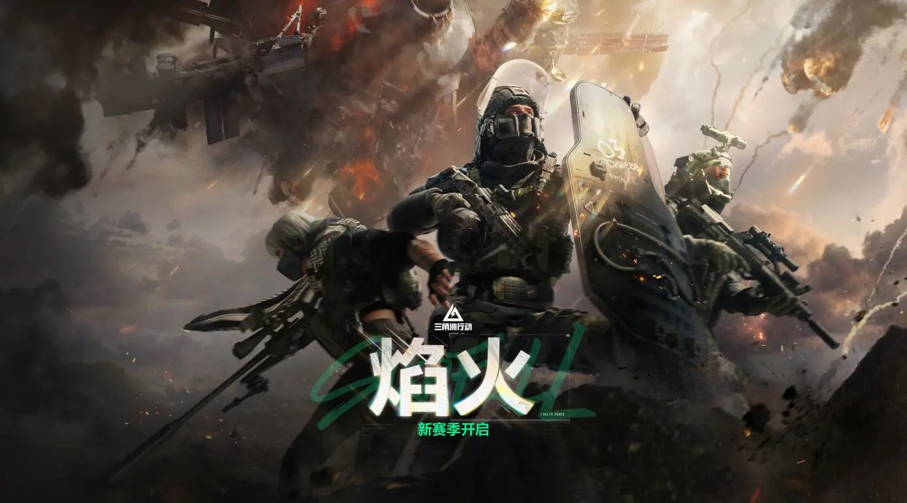
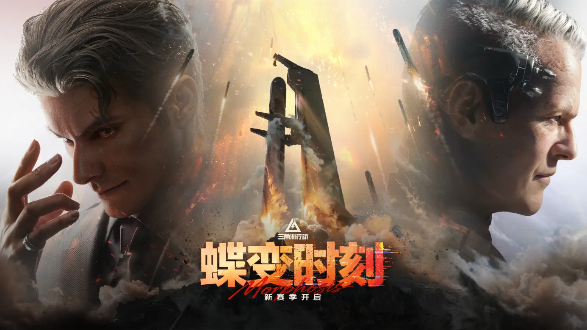
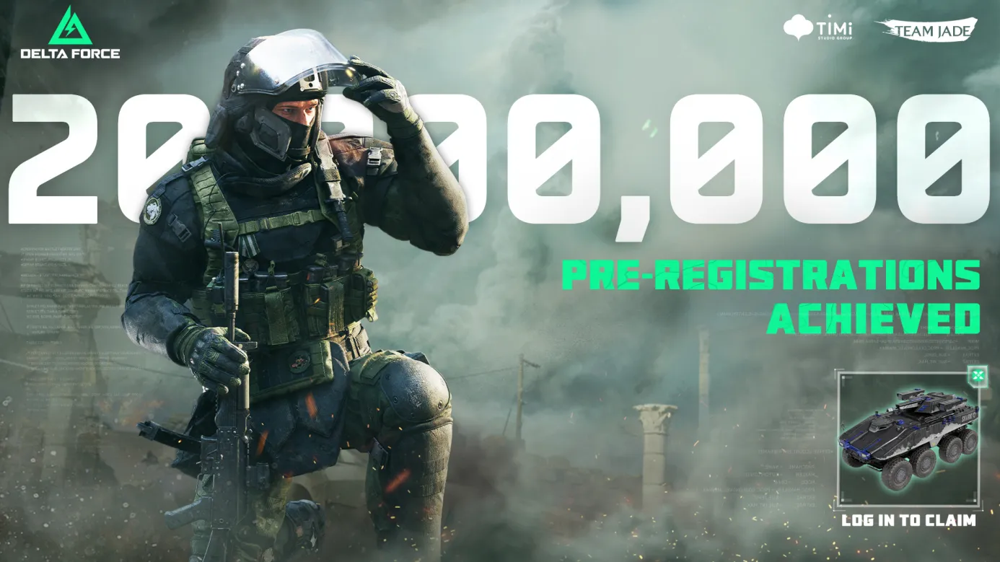
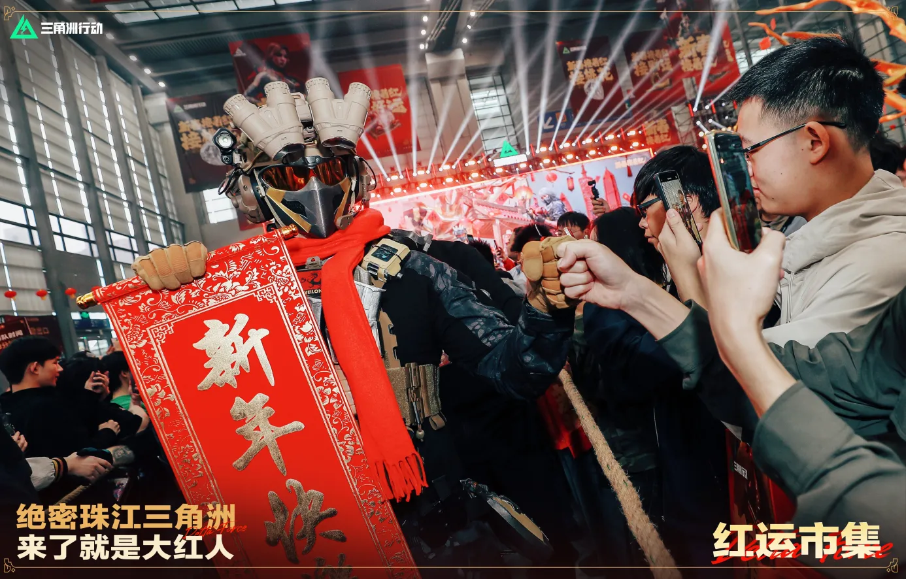

# 《三角洲行动》：通往“未来游戏”的路上，没有“成功公式”
## 一、开篇：通往“未来游戏”的路上，没有“成功公式”
2022年年中，项目组正式在上海组建PC技术团队，承担起DF转型PC的使命，当时业务重点是端手一体化的技术方案和黑鹰坠落剧情关卡。到了2023年4月份，手游版本已经跑得比较快，同时进行了一轮先行核心用户CE，测试的结果玩法因为兵种系统、战斗3C、局内行动，AI的投入获得了一定用户的认可，但是产品的热度较低，产品的势能不足，团队内部也有所担心。

当时团队希望基于最优秀的玩法，做好迭代，以更低的门槛和更高的品质，更全面地覆盖更多用户。那么更高的品质，就需要登陆PC平台。

2023年8月，团队带着首个PC PV登陆了科隆游戏展。

Leo在展会上转了一整天。他看了EA，看了育碧，看了动视暴雪，最后回到我们的临时办公室，说了一句话：“只出手游，在全球市场不会牵起比较大的关注。”

那一年，我们原本的计划是做“以手游为主的端手一体的游戏”。移动端是我们最熟悉的战场，我们在这个领域摸爬滚打了2代产品，积累了足够的经验和自信。用这些经验做一款顶级的射击手游，听起来是一条理所应当的路——毕竟J3在这条路上已经证明过自己，但科隆给了我们当头一棒。

作为全球最大的游戏展会之一，每年8月，全世界最核心的玩家和媒体都会聚集在这里。对于一款想在全球市场有所作为的游戏来说，这是必须被看见的地方。那几天Leo在展会里走，发现了一个很残酷的现实：在这个牌桌上，手游是没有位置的。不是说手游不好，而是这里的玩家、媒体、意见领袖，他们的注意力天然地放在PC和主机上。一款只有手游的产品，连被讨论的机会都很少。

虽然“三角洲特种部队”（Delta Force）是一个拥有20余年历史的经典战术射击IP，但在长达十余年的时间里几乎从主流视野中消失，直到我们拿下IP重启项目。但我们没有《COD》那样的品牌积累，也没有战地那样的历史底蕴。一个“新”IP凭什么让人下载？我们必须先在PC端证明自己。我们在PC端如果都立不住，产品势能将面临比较大的问题。

回国后，团队气氛很凝重。把方向”调整到“PC优先”，同时决定当年11月份就开启PC的技术测试。这意味着团队从做一款游戏变成做六款游戏——移动端加PC端，大战场、搜打撤、黑鹰坠落三种玩法的排列组合，还要同时应对完全不同的技术栈和玩家预期。有人提出质疑：我们真的要这么做吗？代价会不会太大？

那天，没有人能给出我们确定的答案——虽然现在回头看，如果当时没决定做PC端，这游戏可能就死了。但在当时，没有人能预见这个结果。所有先进的、没人尝试过的东西，大家都会畏惧，这是人的本性。我们能做的，就是继续往前走，用结果来回答。

如果你期待这篇文章能给你一套可以复制的方法论、一个可以照搬的公式，那可能要让你失望了。回顾《三角洲行动》这一年多的历程，我们最深的体会恰恰是：通往“未来游戏”的路上，没有“成功公式”。我们做的只是保持创作的初心，然后不断做自己擅长的事情，一直迭代下去。

这篇文章不是来讲“我们多牛”的，是来记录“我们经历了什么”的——那些走过的弯路、做过的选择、付出的代价、收获的验证，以及仍然悬而未决的挑战。

 

## 二、“我们最大的优势是这支团队”
2003年，琳琅天上成立。那是中国网络游戏的黄金年代，端游是最主流的形态，也是最有想象力的战场。我们做过《QQ飞车》《逆战》《枪神纪》——那时候的团队相信，只要足够努力，端游可以做出不一样的东西。整个行业充满了探索的热情，大家都在尝试，都在试错，都在寻找属于中国游戏的表达方式。

然后是2014年，移动互联网的浪潮席卷而来。那几年发生的事情，现在的年轻同事可能很难想象。智能手机普及的速度超出所有人预期，移动游戏的增长曲线几乎是垂直的。端游市场不是在萎缩，而是在被快速超越。几乎所有人都意识到，我们站在时代的分岔路口。大家都上了移动互联网的高速列车，整个行业的重心转移了，而我们也顺应潮流，汇入手游大海。

接下来的几年，我们在移动端做到了行业前列。《穿越火线手游》全球累计注册用户超过4.5亿，《使命召唤手游》上线首年营收超过10亿美元。从数据上看，这是成功的转型。但心里始终有个念头没有熄灭：什么时候能回去做端游？

不是说手游不好，而是端游有一些独特的东西——更极致的画面、更复杂的系统、更深度的体验——这些是移动端很难完全实现的。对于一群从端游时代走过来的人来说，那种情结一直在。

《三角洲行动》的很多重要岗位，都是《逆战》时期的“老兵”。有人用“重聚”来形容这次项目启动，这个词很准确。不是新团队在做新项目，是老朋友们带着这些年的积累，回来做一件一直想做的事。所以科隆那个决定，表面上看是一个战略转型，但对我们来说，更像是一次回归。

如果我们能够利用好团队的能力做好玩法迭代，让产品在市场上有独一份的价值；同时能够成为市面上第一个多端高品质的FPS产品，这么一个有独特价值的产品需要借助品牌效应，那么在国内通过琳琅天上头部品质，能够建立市场和玩家的信任，也希望通过这个品牌慢慢走向全球。

说回“三角洲”这个IP。2000年左右，我们团队中有人第一次接触《三角洲特种部队》，那超级无敌大的地图给我们留下了极为深刻的印象。对很多人来说，“三角洲”是射击游戏的启蒙——那种在辽阔地图上自由行动的感觉，在当时是前所未有的。

但现实是残酷的。“三角洲”IP已经被《COD》和“战地”超越，近20年来几乎没有热度。拿到这个IP的时候，我们面对的是一个尴尬的局面：它有情怀，但情怀不能当饭吃；它有历史，但缺乏传承的厚度。我们怎么才能重新激发一个沉寂了20年的IP？这不是一个简单的“炒冷饭”的问题。

我们要做的不是复刻一个老游戏，而是用这个IP承载一些新的东西：关于跨端、关于全球化、关于射击品类的未来。但在找到这条路之前，我们也走过弯路。

 

## 三、也曾感到彷徨
2021年，我们曾陷入“成功公式”的困扰。那一年，行业里最热的词是“开放世界”。《艾尔登法环》的预告片刷爆了社交媒体，《星空》的期待值拉满，《赛博朋克2077》成为新一代人的GTA，大家都在讨论开放世界的可能性。每次行业交流，话题总是会绕到这个方向上：开放世界是不是未来？怎么把开放世界做好？哪些品类适合做开放世界？我们也动心了。

“开放世界+搜打撤”，这个组合听起来极具潜力——一个辽阔的、可自由探索的世界，配合搜打撤的紧张感和战术深度，想想就让人兴奋。于是我们调整了方向，开始在这个方向上投入资源。设计团队做了很多探索，美术团队也跟着调整，整个项目一度朝着“开放世界射击”的方向前进。

现在回头看，游戏中每一张地图实际上是连在一起的，这也是当时做开放世界遗留的结果。

“学我者生，像我者死。”这句话是我们在那段时期最深刻的体会。开放世界不是不能做，但它不是简单地把地图做大、把边界去掉。它需要一整套设计逻辑来支撑——任务系统、探索奖励、世界事件、动态生态……这些东西我们没有积累，强行去做，就是邯郸学步。如果只是模仿市面上成功产品的表象，却没有学会它们的精髓，结果只能是失败。

失败的项目中也有精华，做好沉淀和吸收就是值得的。问题不在运营，更不在产品，而是对市场本质的理解不够深。所有的错误都让我们对市场的过度归因变得更加谨慎：不是因为某个品类火了，你做这个品类就能火；不是因为某个玩法流行，你加上这个玩法就能成功。

首先早期《三角洲特种部队》IP的四大核心Pillar是：“真实开放的世界反恐行动”“真实可信的角色”“开创性的声音系统、技术突破”，以及“无缝无边界的真实世界”。那么，下一代“三角洲”以什么为核心呢？我们曾经投入以PVE为主的Sandbox-Mission开放世界制作，探索下来发现机会点既不是纯单局循环游戏，也不是以PVE内容为填充的开放世界，而是更适合长线Gaas化更新、更强调局内外循环、更强调复玩性的PvEvP沙盒大世界玩法。

正是这段弯路，让我们在2023年更容易接受科隆的那个判断。与其追逐市场热点，不如回到我们真正擅长的事情——保留“三角洲”战术策略性的下一代PvEvP射击游戏，以干员为特色的PvEvP，多人大战场，用技术和品质说话。

做出决定只是第一步，我们接下来要面对的是——选择带来的代价。

 

## 四、那么，代价呢
选择了PC，就意味着选择了一条更难的路。

移动端加PC端，大战场、搜打撤、黑鹰坠落——我们一直在做六款游戏。这不是夸张。两个平台，三种玩法，排列组合就是六套内容，每一套都有自己的用户群体、技术要求、运营节奏。团队规模峰值达到几百人，上海作为“突击队”，深圳做产品设计，两地协作，多线并行。这个组织本身就已经非常复杂了。

更难的是那种螺旋上升的痛苦。行业往往会有更新更高的“刻度”出现，当你觉得做得差不多了，看看竞品，发现标准又提高了。我们只能推翻方案重新思考，推翻后又再去考虑手游……是这样一个逐步迭代、螺旋上升的过程。开发、策划、TA这些团队什么时候进？什么时候出？资源怎么分配？优先级怎么排？这些问题没有标准答案，只能在实践中摸索。

有些同学在这个过程中接受不了这种组织架构的频繁调整，选择离开。每一次战略调整，都会有人不适应——不是能力问题，是方向问题。有些人更适合稳定的环境，有些人更能接受变化。

我们约离开的同学吃饭，告诉他们：“感谢你对《三角洲行动》的付出，没有你前面的摸索和迭代，就没有我们的现在，团队会一直为你未来‘背书’。”有人听完哭了。

这是真实的代价，不是数字，是人。

几乎每天都听到人说，你们要做跨端，这条路是不是走错了，做跨端难如登月，需要这么大的投入，能不能成？这些质疑不是恶意的，是真诚的担忧——跨端在当时没有成功先例，投入巨大，风险也巨大。

这几年做下来最难的时刻是什么？是“真的扛不住了”或者“开始怀疑自己”的时刻。既然付出了这么大的代价，我们必须确保产品在技术上能站得住脚。而要在全球市场和COD、战地正面竞争，光“能用”不够，必须“领先”。

 

## 五、技术刻度：从精准搜寻到饱和打击
我们内部有一个概念叫“技术刻度”。如果一款游戏要在全球竞争中取得优势，它的技术刻度要与行业主流或领先在同一基线。怎么定义这个基线呢？很简单，看Steam上top10的同期发布同类产品，我们的各项标准需要优于它们。

如果把这个技术刻度分为0到100，0—1是研究如何把内容安置适配，1—90是研究每一种配方和构成，90—100才是竞争区间。大部分产品在1—90之间就停住了——做到“能玩”“还行”“不错”，然后就开始运营变现。但如果你想在全球市场竞争，必须进入90—100的区间。那才是真正拉开差距的地方。

对于跟GamePlay紧密相关的3C与动作表现，我们以行业头部产品表现为标杆，为了整个动作系统的细节丰富度，物理真实感和切换流畅度融入了新的技术框架，引入弹簧模拟肌肉运动规律以达成更逼真的惯性表现和更真实的质量与力量感。

拿小维度破损来说：被子弹击中的墙皮如何脱落？破损的形态是随机的还是有规律的？破损如何与玩法结合？这不只是视觉效果的问题，而是让玩家通过弹孔判断敌人位置、武器类型、射击角度。一个细节，能衍生出战术深度。

同时针对不同的地形环境，通过定制的FootIK和SlopeAdapting机制，更好地完成对环境和地形高度变化的动作适配。通过丰富的过渡动画细节，精准可控的混合层级结构及精细的程序动画机制，把游戏的动作表现对齐到行业最高标准水平，这里从立项到上线一直坚持投入。

动作系统工艺上，动作量从千的量级提升到了以万为计算的量级，同时我们又完成了从角色状态，动作表现，角色部位，专业细节动画等整体动作系统的升级迭代。然而这里又花了超过2年的调优。

空间音频也是。我们要把音频信息从数据维度做声学建模，把游戏场景里每项战术相关内容都加上声音属性。脚步声、枪声、开门声、换弹声，每一个声音都要准确反映方位和距离。玩家闭着眼睛，光靠听，就能判断敌人在哪个方向、大概多远、拿的什么枪。

植被生成同样如此。我们要考虑每个植被里分布的落叶，树枝的摆动方式，草丛被踩过之后的形态变化——一切让虚拟世界更具真实感的内容。

在跨端的考虑和支持上，力求做到高质量动作表现及移动端性能间的动态平衡。多端的动态网格生产基于统一的基础骨架进行生产，并共用同一套动作资源。PC和主机端Mesh会应用高精度LOD以及一些额外骨骼用于更精细的动作展现。PC和主机端资产也应用额外的细节部件用于丰富角色表达。移动端则通过动态特性规划和更精细准确的重要性评估系统，把有限算力集中在重要角色身上，从而达成更高质量的动作表现，让一些表现上的小瑕疵尽量出现在非重要角色或者玩家关注不到的角色身上。

这些细节，普通玩家可能说不出来，但他们能感受到。玩完之后会觉得“感觉很对”，却不一定知道“对”在哪里。这就是“刻度”的意义——不是经费爆炸的炫技，而是“润物细无声”的体验。

我们决心以年为单位去做无限投入、投到透，相信总有一天能投出行业标杆的效果。方方面面做到全球第一是一个很高的目标，但我们决心以年为单位去做。以年为单位，意味着你要接受短期内看不到回报，意味着你要在别人质疑的时候继续投入，意味着你要相信积累终会有回报。

技术刻度解决的是“能不能打”的问题，但我们还想再往前走一步——在一个追求留存数据的行业里，做一个“不追求留存”的内容，看看会发生什么。

 

## 六、打破“全面战场”的垄断
当我们决定做大战场时，有一个问题一直在脑子里转：为什么全球只有一个“战地”？

答案很简单：因为这方面的技术、品质和gaas化运营要求非常高。“战地”系列摸着石头过河，钻研大战场玩法十余年，也没能取得长线运营的普适解法。国产FPS游戏缺乏类似的先前经验，却要挑战大战场题材，意味着要用较短的时间追赶国外大厂十余年的进度。这显然不是一朝一夕能办到的，但我们还是决定做。

《三角洲特种部队》IP的核心记忆是行业首个大规模兵种作战的真实大战场，丰富的武器种类和高度还原的细节是《三角洲特种部队》的一大亮点，以2000年发售的《大地勇士》为例，有13种主武器、3种副武器、5种自卫武器、2种投掷物、4种爆破物、3种辅助装备，还有水下呼吸器、消音器、狙击枪镜面反光……即使以当今的眼光来衡量，《三角洲特种部队》的武器系统依然非常丰富、还原。《三角洲特种部队1》最多支持32人在线对战，后续作品不断增加作战规模上限，在写实军事射击领域开辟了多人网络对战的先河。

全面战场要做的是32V32的大规模PVP对战，海陆空三栖载具协同作战，攻防与占领两个核心模式。它不单是对《三角洲特种部队》过往作品中超大规格地图的延续，也是国产FPS游戏对大战场题材的首次正面挑战。我们的目标从定调开始，就是让所有人都能玩到高品质的“全面战场”。这个目标听起来简单，做起来极其复杂。同时，目前大战场题材的手游仍旧存在缺口，缺乏一个“行业标杆”，这也为我们的目标赋予了独特的价值。

大战场的难点在于如何为玩家提供“战争幻想”。64个玩家同时在线，步兵、坦克、直升机、冲锋艇各自为战又需要协同配合，地图需要给玩家带来主题沉浸感同时，还要保证攻守双方的节奏控制、复活机制……需要确保玩家享受战斗爽感，每一个变量都会影响整体体验。战地系列做了二十年，依然会在《战地2042》上栽跟头，《战地6》目前steam在线峰值也较首发巅峰跌去85%以上。我们凭什么觉得自己能做好？这条路没有捷径，我们唯有想清楚可以怎么做，然后堆砌时间，精力与失败经验。

地图设计和技术力带来的品质上，我们吸取了大量外厂的先进经验。烬区、攀升、风暴眼、金字塔，以及最新上线的余震，每一张地图的平均制作周期超过一年，从冰岛的地貌到金字塔的布局，从北非的人文建筑到城市地图的路网规划。S5赛季的“风暴眼”带来了游泳与暴风雨天气系统，整体质感被玩家评价为“上升到了战地5的程度”，而最新S8赛季的“余震”则通过真实的地震演绎、大量的楼房破损和可交互物件数量，沉浸感效果被玩家称为“比战地更战地”的程度。这两张地图从地图设计到技术力展示，都承载了团队大量的思考和心血，也成为三角洲开服至今“最能打”的大战场地图。

音乐制作上，我们请来了“战地”系列的作曲家约翰·索德维克。他参考自己在制作战地时的经验，使用民族乐器和鼓来匹配游戏的虚构世界，在音乐中表达悲伤和孤独，让战场氛围更具沉浸感。但我们也必须承认，全面战场目前还不完美。

产品海外上线后，面对COD、战地的用户，他们对于游戏艺术设计要求更高，更加自洽、有新鲜感的世界设定是基本门槛——这些三角洲做得还不够。攻守方的胜率平衡、地图节奏的把控、载具与步兵的配合……每一个版本都有新的问题需要解决。“再做好一点”“超用户预期”成为团队口中经常讨论的话题。

比如团队观察到，大战场中的核心玩家对更深的战场策略博弈有明显的诉求，这一份诉求在S4赛季得到了兑现，正式上线的胜者为王模式带来了指挥官+小队的强战略对抗框架，全员开麦沟通协作，从gameplay角度大幅增强了战场中与战友共同奋战的沉浸感。紧接着，2025年年中的ACL国际对抗赛，以及12月的国际邀请赛，胜者为王作为比赛模式为全球的大战场用户带来了精彩的比赛效果。“战地”都没有做到的电竞，我们用自己的想法和坚持完成了一次“没有参考对象”的突破。

类似的案例还有很多，核心理念是我们一直在坚持为玩家提供独一无二的价值——移动端大战场就是我们重要的坚持之一，上线后经过不懈的迭代优化和运营，移动端的用户比较稳固。这证明了在手游端，我们填补了一个市场空白——一个高品质、可随时随地体验的大战场射击游戏。而对于PC端，我们的目标更远：进行GaaS化的改造，成为国内唯一的高品质大战场端游，以及全球独一份的GaaS化大战场网游产品。多端互通+GaaS化+高品质的商业降维，帮助我们打开海外局面，对于习惯买断制的欧美玩家来说，是一种极具吸引力的“平替”甚至“优替”。我们会坚持品质驱动，持续投入提升，努力接近甚至超越战地的水平。

可能再过两年，全面战场的品质会迎来翻天覆地的提升，因为我们的产品，奉行的是“长期主义”。

全面战场有自己的用户群体和价值定位，聚焦核心用户以及它的独一份价值，而不是分散。它承载的是“爽快娱乐”的体验——节奏快、反馈强、上手即玩。这和搜打撤的“战术深度”形成互补，也和接下来要讲的“黑鹰坠落”形成对照。

如果说全面战场是对市场需求的回应，那“黑鹰坠落”则是对创作初心的坚守。

 

## 七、黑鹰坠落：做出打动自己的体验
1993年10月3日，索马里首都摩加迪沙。一场原本计划30分钟完成的抓捕行动，因为两架黑鹰直升机被击落，演变成了持续15小时的激战。不到100人的美军突击队，面对5000多名索马里武装人员的围攻，18人阵亡，73人受伤。这是越战以来美军最惨烈的一次地面战斗。

2001年，导演雷德利·斯科特把这段历史拍成了电影《黑鹰坠落》。电影用纪实风格还原了战争的残酷与混乱，没有突出的“英雄主角”，只有在枪林弹雨中挣扎求生的普通士兵。这部电影深刻影响了后来的战争片美学，也成为无数军迷心中的经典。

2003年，NovaLogic工作室推出了《三角洲特种部队：黑鹰坠落》，在游戏中几乎忠实还原了这场战役。这也是《三角洲特种部队》系列最畅销的一部，奠定了战术FPS的雏形。

二十多年后，当我们决定做《三角洲行动》的战役模式时，“黑鹰坠落”是唯一的选择。这不仅是对经典的致敬，更是对“三角洲”这个IP最核心精神的回归——战术、拟真、残酷、兄弟情。

但我们想做的不只是“高清重制”。

如果线性外推下去，会出现一种恐惧：哪天出现一款新品就可能颠覆我们。追求留存，本质上是结合玩家心理做设计，科学因素重——什么样的反馈能让玩家继续玩下去？什么样的节奏能最大化在线时长？什么样的奖励结构能让人欲罢不能？这些都可以数据化、公式化。行业里有成熟的方法论，照着做，数据不会太差，但我们想做一些不一样的事。

“黑鹰坠落”要做的是回归创作初心，积累在人文叙事上的表达能力。这是其他同类产品从未有过的、对于内容型PVE的投入量级——UE5引擎打造电影级画面，Nanite超高精度渲染，全局实时动态光源，摩加迪沙全城市扫描还原。电影中标志性的回形酒店、降落在屋顶的小鸟直升机、黑鹰坠机的地点等等，都被我们在游戏中进行了复刻。除此之外，我们还用七个关卡致敬了电影的经典剧情。

自研独一份，对团队也是新挑战。当策划和技术搭好了关卡，团队所有人会聚到同一层楼一起体验。那个场景很有意思——几十个人挤在一起，盯着大屏幕，有人拿着手柄在玩，其他人在旁边看。唯一的评判标准是：好不好玩，尖不尖叫，感不感动。没有数据指标，没有留存目标，仅依赖作为玩家——最原始的判断，即这个东西“能不能打动人”。

结局不是你赢了，而是你打完最后一颗子弹，被击毙，然后是守护家人的照片。第一次看到这个结局的时候，现场安静了几秒钟。有人说“太狠了”，有人说“这才对”。它是创作，是表达，不是一种玩法设计。我们希望做一些突破常规的尝试，让人们喜欢上那些他们一开始并不熟悉的事物。

技术有了基础，内容也做了尝试。这些准备能不能转化为市场结果，要靠上线来检验了。“黑鹰坠落”正式上线时间是S3焰火赛季的赛季中，比我们预想中有所推迟，但是结果依然是喜人的。2025年春季开学季，因为“黑鹰坠落”的发布，内容生态爆发，结合春节返校带动了社交破圈，突破了FPS用户最后的心智，“三角洲”的PC用户迎来了增长。

 

## 八、一二三，坐上最大的牌桌
经历了2024年3月的线下试玩会、Zero测试直播生态的爆发，让团队松了一口气，它直接验证了以PC为主的决定；9.26上线首周2500万注册，PC端占比70%，玩家确实愿意在PC端玩这款游戏，而不只是把它当成一款手游的“PC版”。之后的数据曲线更让人意外：2025年4月日活1200万，7月2000万，9月突破3000万。到2026年1月，DAU正式突破4100万。

数月千万级的增长有力地说明，游戏在长线运营期依然具备强大的爆发力。更重要的是，《三角洲行动》成为腾讯首个“四全”IP——全球化发行、全终端上线、全平台打通、全自控IP。这不只是一款游戏的成绩，是一条路径的验证，但比起数据，更让我们在意的是另一件事——被看见。去年我说DeltaForce，基本没人知道它到底是干嘛的，但今年大家至少知道你了，这就算是好的开始。这句话很朴素，但很真实。对于一个新IP来说，最难的不是做好产品，是让人知道你。在一个已经有COD、有战地、有无数成熟射击游戏的市场里，一个新名字要被记住，需要的不只是品质，还有时间。让玩顶级端游的人愿意来玩你的游戏——如果没到这个Level，别人看都不看你。

我们现在至少触摸到了这个Level。被看见，是一切的起点。而且有些价值需要时间来证明。比如威龙，这是一个有门槛的干员，初期使用率不高，但上线第90天后使用率逐步上升。玩家需要时间学习，需要时间发现它的价值。比如航天基地，这张地图的喜欢人数也在不断上升。独特的体验往往伴随着初期的小众，我们切莫短视，需要长期主义投入进行建设。

产品海外上线，面对COD、战地的用户，他们对于游戏艺术设计要求更高，更加自洽、有新鲜感的世界设定是基本门槛，这些三角洲做得还不够。同时当产品超过3000万用户的这条线的时候，搜打撤玩法已经从垂类玩法推上了大众，那么大众玩法如何快速进化成平台型搜打撤游戏的终极形态又是一个巨大挑战。如何每个版本都能创造超越用户预期的新鲜感的时候又是一个需要不断解决的难题，“再做好一点”，“超用户预期”又变成团队口中经常讨论的话题。

上线后数据验证了方向是对的。但对于一款志在长青的产品来说，上线只是开始——运营期的挑战，和研发期完全不同。

 

## 九、步履不停：以“搜”发现增长点，以“打”实现业务闭环
上线之后，我们给自己定了一个原则：克制。不做低价值短期“新鲜感”内容，不为了数据好看而堆活动，把资源投入到长期发展的、独一份的价值上。这需要勇气，因为短期数据可能不好看，可能被质疑。但我们相信，长期来看，这是对的。

回顾过去的赛季，产品经历了几个阶段。

S1—S2是产品落位期。以点带面，用独特价值切入市场，多端互通最大程度发行爆发，当时用户对三角洲的印象是高燃激爽的干员搜打撤、全面战场游戏，是新一代的品质标杆。团队确立了内容生态与产品势能为基础的宣发范式，面向FPS用户摆差异，获得了用户的喜欢。但是为了追求“当下的确定性”，快速更新稳住用户。但也踩了坑——游戏内核机制变动引发信任舆情，用户有所下滑。教训很深刻：核心体验不能轻易动。玩家对一款游戏建立了肌肉记忆和心理预期，你去改变它，哪怕改得更好，也会引发抵触。经过了一定的调整，用户稳定在了700W的规模，具备了长青的潜力。

S3—S4是产品的裂变成长期，通过持续保持新鲜感的正向版本，获取用户。通过S2的教训，战斗系统、经济系统、分层用户体验、新手引导等基础体验内容越来越稳定，产品也具备了继续往前迈进的稳固内容。这两个赛季我们进行稳固的版更，红薯窝、干员、基础地图优化、黑鹰坠落、黑夜模式节等。通过“黑鹰坠落”引爆产品势能。内容生态快速增长，春节、返校季、猛攻节的社交传播助力产品突破了FPS用户最后的心智，产品进入快速成长期。

暑期，产品迎来了多元的用户。正逢游戏上线一年，我们选择继续拔高游戏产品刻度，以超越玩家预期的主题和事件提供独特新鲜感。除去不断升级玩法，我们也围绕IP联动、全球电竞赛事、周年庆等构建了更完整的游戏生态。商业化上，联动《明日方舟》，为三角洲融入了“内容型”用户，但也因为商业化价值过快释放，也让团队明白此阶段应该“多种树”而非“摘果子”。

S6是周年庆。呈现“内容与文化共鸣”，这是超大DAU游戏的“大考”，产品通过文化营造，多元流量的精耕融入了非FPS的大众用户，在烽火地带，我们经历了夺取“大红”时的欢呼雀跃，“花来”成功时的会心一笑，“火箭玫瑰”绽放时的感动瞬间，以及“剥蒜情谊”带来的开怀时刻。“疯疯火火三角洲好汉歌”，文化与玩家共鸣并放大。3000万DAU的“现象级游戏”，也面临着必经阶段的挑战，共享监狱上科学主义精神的决策，情感上也辜负了玩家。也让三角洲团队游戏内外重新梳理多元生态内容，同时保证游戏整体生态健康稳固发展。

S7是主动求变。“年底沟通”，游戏内外重新梳理，版本内容重新落位。用户沟通方式面向稳定，关注情绪和态度，行动远比语言更有力。多元生态深度思考，产能遭遇挑战。产品战略重新梳理，迈入“现象级超大DAU”后的新阶段。

刚到来的S8定名“蝶变时刻”。备受期待的“航天基地2.0”将正式实装，水下战斗内容也将随之解禁，彻底改变现有的战术维度。如果说2025年是“打江山”，那么2026年的首要任务就是“保持用户活跃基础上，继续突破”——把4100万DAU转化为更长线的留存。

站在现在远眺未来，搜打撤是我们的核心差异化，但它不应该只是一个垂类玩法，而应该成为一个可以承载更多内容的平台——从垂类到大众，平台型搜打撤游戏的终极形态。全面战场有自己的用户群体和价值定位，聚焦核心用户以及它的独一份价值，而不是分散。多玩法平台生态服务用户，通过新鲜内容做现有用户激活，针对未被满足的核心用户需求，通过新的玩法内容尝试重新卡位。

国内的运营逐渐走上正轨，但我们的野心不止于此。转身看海外，我们也做到了太多“第一次”。

 

## 十、我们的目标是“星辰大海”
2024年12月5日，PC版全球上线。这是公司内第一款国服和海外Steam同步发行的产品。

2025年4月21日，全球双发行方手游上线。这是J3第一款海外自发行手游。

2025年8月19日，主机版上线。这是公司自研的第一款跨端主机产品。

2025年9月23日，首次三端同天更新。这是公司内第一款实现三端同步更新的产品。

2025年11月18日，再次三端同步更新，形成常态化节奏。

转身回看，我们做到了太多“第一次”。每一个“第一次”背后，都是无数次的协调、妥协、推翻、重来。PC和手游的更新节奏不同，主机的审核流程不同，不同地区的合规要求不同，不同文化的玩家偏好不同——把这些全部对齐，让全球玩家在同一天玩到同样的内容，听起来简单，做起来极其复杂。光是一次三端同步更新，就需要提前数月协调各平台的审核时间、测试周期、上线窗口，任何一个环节出问题都可能导致全盘延期。

但这些“第一次”的意义不只是打破纪录。它们证明了一件事：腾讯自研的产品，可以在全球市场用自己的节奏做发行，而不是永远跟在别人后面。

国服和海外在不同文化背景下，呈现两极分化的双玩法倾向性。我们发现，西方玩家更要“爽快”——节奏快、反馈强、上手即玩；东方玩家更要“深度”——策略丰富、成长感强、有钻研空间。欧美市场，游戏艺术设计要“对味”，符合他们的审美预期；东方市场，游戏玩法要“新鲜”，要有差异化的体验。

这不是简单的本地化问题，而是产品定位的问题。同一款游戏，在不同市场要强调不同的卖点，甚至调整不同的参数。这需要对每个市场都有深入的理解，也需要灵活的产品架构来支撑。

Mark在员工大会上指出，2025年腾讯国际市场业务贡献了游戏总营收的30%，全年海外营收规模已稳超100亿美元。《三角洲行动》是理解这“100亿美元”含金量的最佳样本之一。

自有IP通过技术革新、玩法价值、全球内容生态发力，正在从“单产品”向全球“多端平台生态”新形态转移。这是一条没人走过的路，但我们已经迈出了第一步。

 

## 十一、结语：与己迭代，其乐无穷
回到开头的问题：通往“未来游戏”的路上，有没有“成功公式”？

我们的答案是：没有。但有一些东西比公式更重要。

从技术上，我们追求“刻度”，不是炫技，是让玩家说不出哪里好，但就是觉得“对”；从玩法上，我们追求“独特价值”，搜打撤不是终点，而是一个可以承载更多内容的平台；从内容上，我们追求“创作初心”，黑鹰坠落证明了，在追求留存的行业里，依然有空间做一些“不追求留存”但能打动人的东西。而所有这些，归根结底都是人。

如果《三角洲行动》今天在业务和技术上有了一些突破，本质上不是我们的技术或理念先进，而是这个团队先进。这支团队的基底是从2011年就一起走下来的，经历《逆战》《穿越火线手游》《使命召唤手游》，一步步积累。不是某一个人特别厉害，是这群人在一起特别厉害。新人带来前沿视野，“老炮”带来行业经验，两者相融合，让这个“发动机”有持续运转的活力。

但真正的挑战不是外部竞争，而是内部停滞。如果有一天我们没有了新思考，不进步，跟不上时代，就会被抛弃。这是最真实的担忧。不是竞争对手会打败我们，是我们自己会让自己过时。

Shadow在今年的Tap Tap游戏大赏上说：“在工作的过程中，其实我们团队常问的一个问题就是——一个产品的玩法的独特价值是什么？”这个问题我们问了很多年，还会继续问下去。因为一旦停止追问，就意味着停止进步。

《三角洲行动》打了一场漂亮仗，但可能我们马上又会跌进下一个坑。当然这也无所谓，只要我们还是沿着这条路往下走。这是一种心态——接受不确定性，接受可能的失败，但不停止探索。

我们从来追求的就不是成功，而是这一路收获的经验，以及迭代本身的乐趣。《三角洲行动》证明了一件事：腾讯自研+全球化+射击品类+新IP，这条路走得通。这不只是一款游戏的成绩，而是一种可能性被打开。

搜、打、撤——自我反省，迎难而上，迭代提升。这是属于三角洲团队自己的节奏，也是我们作为从业者最骄傲的地方。

而属于我们的未来，才刚刚开始。